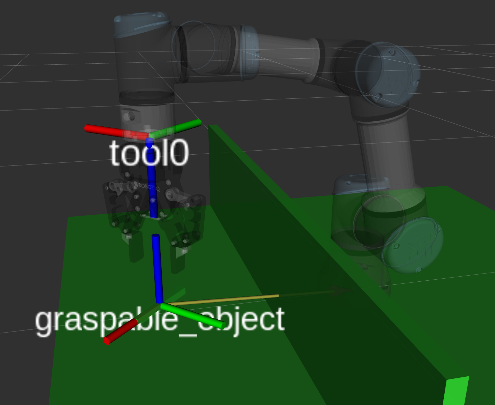
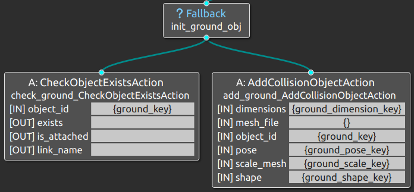
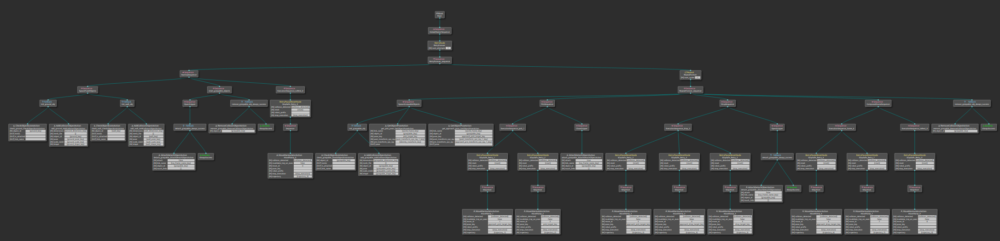

# Workshop - ROSCon 2025 FR + DE - Building your first Pick & Place application with ManyMove

## 1. Starting the demo

We'll execute a simple pick and place application with a Universal Robots UR3e.

If you are not already in manymove's docker container, start it in a terminal with this command:
```bash
MANYMOVE_NO_GPU=1 && bash ~/workspaces/dev_ws/src/manymove_color_signal/docker/bootstrap_color_signal_workspace.sh jazzy
```

To edit the code, from inside the container you can run:
```bash
nano $MANYMOVE_WS/src/manymove/manymove_cpp_trees/src/bt_client_ur.cpp
```

The program is already complete: we'll see it step by step, and try to edit it to change the behavior.

Open a new terminal with `ctrl-shift-T` and enter the already started container:
You can use the following command as reference, but container's name may vary so once you arrive to `-it ` you just need to hit `<tab>` key and the container's name should autocomplete.

```bash
docker exec -it <tab> bash
```

You can use this command to execute the demo:

```bash
ros2 launch manymove_bringup ur_movegroup_fake_cpp_trees.launch.py
```

Pressing PLAY will let you start the execution. 
With STOP you execute a soft stop and pause the execution.
With RESET you destroy the program pointer and get back to the beginnin of the behaviortree, opening the gripper and removing the graspable object.

To start the BehaviorTree.CPP visualizer, Groot, in another new terminal run:

```bash
ros2 run groot Groot
```

---

## 2. Create the scene

One of the advantages of ROS and MoveIt is being able to plan dynamically while considering the objects in the scene. Here we'll create the tutorial scene to leverage these functionalities, so it will contain 3 box objects:
* a box representing the ground or the table the robot is fixed to
* a box representing an obstacle wall
* a box representing an object to grasp

Let's start by creating the ground, using a function that simplifies creating all the tree's elements to work with objects:

```cpp
    ObjectSnippets ground = createObjectSnippets(
        blackboard, keys,
        "ground",                                       /* object name */
        "box",                                          /* shape */
        createPoseRPY(0.0, 0.0, -0.051, 0.0, 0.0, 0.0), /* pose of the object */
        {1.0, 1.0, 0.1},                                /* primitive dimensions */
        "",                                             /* mesh file path */
        {1.0, 1.0, 1.0},                                /* scale */
        "",                                             /* link name to attach/detach */
        {}                                              /* contact links to attach/detach */
    );
```

This function creates a series of xml snippets that can be directly used to compose the BehaviorTree:
* check_xml: checks if the object exists in the scene
* add_xml: adds the object to the scene
* init_xml: initializes the object by adding it only if not already in the scene
* remove_xml: removes the object from the scene
* attach_xml: attaches the object to the specified robot's link
* detach_xml: detaches the object from the specified robot's link

Calling the snippet will also create a blackboard key for each input of the function, and their meaning is quite self-explanatory.
Given **name** the name chosen as the name variable of createObjectSnippets:
* name + "_key"
* name + "_shape_key"
* name + "_pose_key"
* name + "_dimension_key"
* name + "_scale_key"
* name + "_file_key"

Without going to deep into details, just know that using these keys you can change the values relative to the object at runtime.
Some of the keys also allows to be modified from the HMI, but that'll be covered in another tutorial.
Most of the following functions use blackboard keys as input instead of their respective values, to be able to make them more flexible.
For example, if you want to access the name of the ground object you'll have to access the "ground_key" key.

The fields not required for a given shape type can be left empty.
* **Primitives** (box, cylinder, sphere) will require to have dimensions specified, and they need to have the correct number of values
* **Meshes** need a mesh file path specified, and they can be scaled freely with the scale parameter

As you may notice, `createPoseRPY()` is an helper function that takes as input (x, y, z, roll, pitch, yaw) and use that to create a pose containing a quaternion, as required by `geometry_msgs::msg::Pose`.

For the wall object we can skip some of the unused input params:

```cpp
    ObjectSnippets wall = createObjectSnippets(
        blackboard, keys, "wall", "box",
        createPoseRPY(0.0, -0.15, 0.1, 0.0, 0.0, 0.0), {1.0, 0.02, 0.2});
```

The wall will be on the way when we'll try and reach the object, and also when we move to the drop position.
The size and position are made to work with the Lite6, when we'll use another robot we'll have to move and/or resize the wall for it to serve its purpose. When you'll simulate a real scenario, you'll either model the obstacles as the fixed objects on the scene or use a camera to localize them and add them to the scene accordingly. If you don't need to interact with them, you can also use the camera to generate an octomap of the scene.

The last object is the graspable box:

```cpp
    ObjectSnippets graspable = createObjectSnippets(
        blackboard, keys, "graspable", "box",
        createPoseRPY(0.15, -0.35, 0.1, 0.0, 0.0, -0.785), {0.1, 0.01, 0.01},
    "", {1.0, 1.0, 1.0}, "tcp_frame_name_key", "touch_links");
```

It's placed within reach of the Lite6 and it's shape and size already match the gripper orientation relative to the robot's TCP.
But beware: the graspable object's Z axis is facing up, while the robot's TCP's Z axis is facing down. We will want them to match when we'll go grab the object, and we'll see that when defining the variable poses in the next section.

Before moving on, please notice that the `tcp_frame_name_key` field was added as input: without a blackboard key that refers to the robot's tcp, the attach_xml snippet will give you an error at runtime, as it won't know to what link you want to attach the object to. Here `tcp_frame_name_key` is just a string, there's no key associated yet: we'll see in the next section how to create it.

The variable `rp` contains al the data of the robot. We'll talk about it in the future, but for now let's just use a couple of its fields:
* `prefix` is an optional field, here is empty. It stores the prefix for the robot, to differentiate the various topics, services and action servers
* `tcp_frame` contains the name of the link that represents the robot's tcp: it's the link we want to attach the object to. In some scenarios, you may want to use another frame to attach the object, for ease of reference: for example, on Franka Emika Panda robot the tcp is not aligned with the robot's flange, so it may be easier to refer to the flange itself and use a offset when using an object's pose.

---

## 3. Define the variable poses

We created the xml snippets for all the objects. If we wanted to, we could define some fixed poses that make the robot correctly pick and place the object, as we usually do in many common industrial scenarios. The graspable object's position is already known as we placed it there, so we could use the same pose to guide the robot, we just need to give it some offset.
One of the main reasons I wrote ManyMove is to try and develop a bin picking solution, and for that we need a way to know the pose of an object dynamically.

It's not that much harder than just using the known pose, and it's very important to create a flexible application.

We want to get the pose of an object and refer to it when moving the robot: to get the pose of an object we can use the helper function `createGetObjectPose()`, wrapped in a `buildObjectActionXML()` function that will output the complete xml snippet for the logic tree.
Let's see how it works:

```cpp
    std::string get_pick_pose_xml = buildObjectActionXML(
        "get_pick_pose", createGetObjectPose(
                             "graspable_key",
                             "pick_target_key",
                             "world_frame_key",
                             "pick_pre_transform_xyz_rpy_1_key",
                             "post_transform_xyz_rpy_1_key"));

    std::string get_approach_pose_xml = buildObjectActionXML(
        "get_approach_pose", createGetObjectPose(
                                 "graspable_key",
                                 "approach_pick_target_key",
                                 "world_frame_key",
                                 "approach_pre_transform_xyz_rpy_1_key",
                                 "post_transform_xyz_rpy_1_key"));
```

The `buildObjectAction()` function just needs as input a name and an object function. Up till now, we masked most of the object functions' usage in the `createObjectSnippets()` function, but here we use one directly.

Let's see what each component does:
* `"graspable_key"`: it's the blackboard key that stores the name of the object. The object name it contains will be used to search for the corresponding object in the scene to get its pose. We need to get the `"graspable"` object's pose, so we use the name key generated with the `createObjectSnippets()` function.
* `"pick_target_key"` and `"approach_pick_target_key"`: the keys containing the `geometry_msgs::msg::Pose` that the robot will use. These are the containers that will store the resulting pose, after the tranformations computated depending of the last two keys of the function. Since we will get the pose dynamically, the pose initially contained by this keys can be empty, but we need to take care not using it before we get the updated value of the object's pose.
* `"world_frame_key"`: this key contains `"world"` as we defined at the beginning of the file. Most of the time we want the pose to refer to the world frame, but we may choose some other frame here.
* `"pick_pre_transform_xyz_rpy_1_key"` and `"approach_pre_transform_xyz_rpy_1_key"`: the keys that reference the first tranform to adapt the pose of the object to the one of the TCP.
* `"post_transform_xyz_rpy_1_key"`: the key to the second transform to apply to the pose of the object, we'll see later why this is useful.

We should spend some words on the transforms. We created the graspable object with this pose: `createPoseRPY(0.25, -0.25, 0.1, 0.0, 0.0, 0.0)`.

If we just get this pose, the approach_pick target and the pick target will be the same. We need to move up the approach target to correctly approach this object, as the TCP is on the robot's flange and not between the fingers. 

The pick key must move up 16.75 cm from the object's pose to get the lower part of the fingers about flush with the bottom of the object, and we add 5 cm more for the approach pose. We want to move in the world's Z+ direction compared to the pick pose, approaching the object from above. The TCP frame in the UR3e (as in many other) have the Z+ axis exiting from the flange, so it will be pointing downward when aligned above the object.
Imagine you want to align the object with the TCP, and the object is stuck with the Z+ axis going upwards: then the TCP will have to approach from below, and if we want to get some distance we need to move towards Z-. Thus, we get this transforms:

```cpp
  blackboard->set(
    "pick_pre_transform_xyz_rpy_1_key", std::vector<double>{0.0, 0.0, -0.1675, 0.0, 0.0, 0.0});  blackboard->set(
    "approach_pre_transform_xyz_rpy_1_key", std::vector<double>{0.0, 0.0, -0.225, 0.0, 0.0, 0.0});
```

As we already said, we want to approach from above, so we flip the pose 180 degrees in the X axis. Given how the Robotiq gripper is attached to the flange, we also need to rotate the gripper -90 degrees to align the fingers with the object:

```cpp
  blackboard->set(
    "post_transform_xyz_rpy_1_key", std::vector<double>{0.0, 0.0, 0.0, 3.14, 0.0, -1.57});
```

You may wonder: couldn't we use just one tranform?
This is a simple scenario, so yes, we could. But using a single tranform may get confusing quicly.
In more complex scenarios, like those in the other executables, the transforms are a bit more complicated and we benefit from separating them in two transforms.
For example: if I were to rotate in the X axis of 45 degrees, but then I needed to rotate in the original Z axis, I would need a different approach as it wouldn't be as easy as inputting the required values. When I rotate the X axis, the Z axis is not vertical anymore, so I'd need a composite transform among the 3 axes. Splitting the transforms makes it much simpler: the second transform is aligned with the original Z axis.

### Visual examples of frames trasformations



In the image above you can visualize why you need to flip the pose: the frame of the TCP is upside down in respect to the one of the graspable object. Rotating 180 degrees in X axis makes the two frames match.
Remember that, if you want to change the inclination of the gripper, the position you start from is the graspable object's one. Also, remember that rotations happen sequentially, so a rotation in Z happens after a rotation in X.

**Excercise**: if you want to grasp the object not vertically but at a 15 degree angle in the Y axis of the object, pointing toward the wall, how do you modify the transform?

<details>
<summary>Click to see the solution</summary>

```cpp
  blackboard->set(
    "post_transform_xyz_rpy_1_key", std::vector<double>{0.0, 0.0, 0.0, 3.4, 0.0, -1.57});
```

If you use this line in the final program you can see how the inclination of the pick movements change!

</details>

---

## 4. Define the moves

We have the objects and their poses. Now we need to create the moves.
The `buildMoveXML()` function helps us build an xml snippet that will enable us to execute a move from the behavior tree. One of its inputs is a vector of Move structs, defined in `manymove_cpp_trees`'s `move.hpp`. The reason to make it a vector is to be able to group together moves that are logically tied.
At the moment, the resulting trajectory of the concatenated moves won't be blended together: they just represent a cohese sequence that won't be interrupted by other logic elements (I/O signals, checks, ...), but the robot will still come to an halt between moves.

For example the pick_sequence is a short sequence of moves composed by a "pose" move to get in a position to be ready to approach the object, and the "cartesian" move to get the gripper to the grasp position moving linearly to minimize chances of collisions.
As we'll se later, we can then compose these sequences of moves together to build bigger blocks of logically corralated moves. We could also keep all moves separated, but it'd be harder to obtain an easily understandable tree later, expecially if we need to reuse a series of moves in a certain logic order.

Each move is defined with:
* **Robot prefix**: each move is to be executed with a certain robot, trying to execute moves that are made for another robot will end up in an error. Only one robot can be without prefix, in which case we can skip this field. In this example we keep it parametric, but it will be left empty in the launcher.
* **TCP frame**: this is always required, even for `joint` moves. It's needed to compute the pose on `pose` and `cartesian` moves, but also to calculate the cartesian speed of the robot for safety regulations. Many cobots and some industrial robot have a cartesian speed limit set in the safety functions.
* **Move type**, which can be `"joint"`, `"pose"`, `"cartesian"` or `"named"`: each type of move will require some of the other inputs below, and will be described later in more detail.
* **Move config**: this set represents all the parameters needed for a move; for now we'll use one of the presets you can find in `move.hpp`.
* **Pose key**: the blackboard key containing the pose for `pose` and `cartesian` moves, of type `geometry_msgs::msg::Pose`.
* **Joint target**: for `joint` moves, a vector of double values whose length must match the number of axes of the robot.
* **Named target**: for `named` moves, a string with the exact name of the preset joint target, corresponding to a group_state in the robot's SRDF. For example, the Lite6 only has `"home"` target by default.

### 4.1. Named targets, joint targets and poses

The simplest target is the `named` target: it's set up in the robot's SRDF, and all we have to do is to set it as target in the move.
We set a string variable in case we reuse it, but we can also use it directly in the struct move's constructor:

```cpp
    std::string named_home = "home";
```

We also need to define pose targets for `pose` and `cartesian` movements.
If you remember the previous section, we defined two xml snippets that transfer the object's pose to `pick_target_key` and `approach_pick_target_key`, but right now these keys are not defined anywhere. Since we want to read them at runtime, we can create two blackboard key with empty poses:

```cpp
    blackboard->set("pick_target_key", Pose());
    blackboard->set("approach_pick_target_key", Pose());
```

Before using them, we need to remember to call the `get_pick_pose_xml` and `get_approach_pose_xml` action nodes to populate blackboard keys.

The `drop_pose` to release the object doesn't need to be reference to some object, as we didn't model the holders of the workpieces. In a real applciation we may want to position an holder and then reference the drop pose to its position, but for now we'll set the drop pose directly. We'll place the graspable object to be in the way for the homing movement, just to be able to appreciate better the potentialities offered by the probabilistic path planning algorithms used as default in MoveIt2 (here, OMPL):

```cpp
  Pose drop_target = createPoseRPY(0.3, 0.3, 0.25, 3.14, 0.0, -1.57);
  blackboard->set("drop_target_key", drop_target);
```

Remember you still have to create the blackboard key, as all `pose` and `cartesian` moves need to read them from blackboard keys, not from Pose variables. This make them potentially dynamic at runtime, while joint targets and named targets are static: they are never dynamic at runtime.

[Note: This may change in the future, but for now I didn't feel the need to use dynamic joint targets. Let me know if you'd need dynamic joint targets!]

We can then define an approach pose to the drop position. Since the pose is fixed, we can copy it with a new name and offset the Z axis to achieve a vertical approach:

```cpp
    Pose approach_drop_target = drop_target;
    approach_drop_target.position.z += 0.05;
    blackboard->set("approach_drop_target_key", approach_drop_target);
```

Last thing we need is a joint target pose: you need to define a vector of doubles of the length of the number of axes of the robot, with all the values within the limits of the robot's joints. There's no compile time check for the number or validity of the joint values, but the move won't be planned if invalid. Here's an example with valid length and values for the Lite6:

```cpp
  std::vector<double> joint_rest = {0.0, -1.57, 1.57, -1.57, -1.57, 0.0};
```

In other examples you'll find joint target vectors for lite6, uf850, xarm7 and panda robots.

**Excercise**: if you want to drop the object not vertically but at a 45 degree angle, what would you modify and how?

<details>
<summary>Click to see the solution</summary>

```cpp
  Pose drop_target = createPoseRPY(0.2, 0.3, 0.4, 3.14, 0.785, -1.57); // modified
  approach_drop_target.position.y -= 0.05; // added
```

If you use this lines in the final program you can see how the inclination of the drop movements change!

</details>

### 4.2. Creating the move sequences

How do we use the targets we just created?
We need to define sequences of moves that are logically tied together. Let's begin with a minimal sequence containing just a `named` move:

```cpp
    std::vector<Move> home_position = {
        {rp.prefix, tcp_frame_name, "named", move_configs["max_move"], "", {}, named_home},
    };
```

If you used some proprietary robot programming language (eg.: RAPID or KRL), this may feel more familiar than directly sending a move commad to MoveIt2.

We define the `named_home` move using the robot's prefix, the `tcp_frame_name` we defined earlier, the move type `"named"`, one of the default `move_configs`, and the `named_home` string. We also need to input an empty string for the pose key and an empty vector for the joint target before the named target. Even if we put a valid value there, it would just be ignored.

Since we are using the `move_position` sequence to home the robot after opening the gripper, we add an exit move to the sequence.
**Modify the previously defined vector of moves adding one line before the named one**:

```cpp
    std::vector<Move> home_position = {
        {rp.prefix, tcp_frame_name, "cartesian", move_configs["cartesian_mid_move"], "approach_drop_target_key"},
        {rp.prefix, tcp_frame_name, "named", move_configs["max_move"], "", {}, named_home},
    };
```

As you can see the structure of the move is similar, but the type is `cartesian`. We also use a different `move_configs` preset, and a blackboard key to indicate where to find the pose for the move. We don't need to specify the empty joint target and named move, as the default values take care of that.

Let's build the rest of the moves in a logical order. The robot will be in the home position on startup. We want to send it to the `joint_rest` position. Here's how:

```cpp
  std::vector<Move> rest_position = {
    {rp.prefix, tcp_frame_name, "joint", move_configs["max_move"], "", joint_rest},
  };
```

As you can see, we use the type `joint` and one of the preset move configs. We can use an empty pose key and just use the `joint_rest` variable directly, which won't be dynamic.

Next we want to grab the object: we first approach it with a `pose` move, then we move to grasping position with a `cartesian` move.

```cpp
  std::vector<Move> pick_sequence = {
    {rp.prefix, tcp_frame_name, "pose", move_configs["mid_move"], "approach_pick_target_key"},
    {rp.prefix, tcp_frame_name, "cartesian", move_configs["cartesian_slow_move"],
      "pick_target_key"},
  };
```

Note that they both use a pose key, but the type and move configs preset change.

After we grab the object, we need a sequence to drop it in the right place: we exit vertically with a `cartesian` move, get to the approach pose with a `pose` move and finally we go in the drop position with a `pose` move.

```cpp
  std::vector<Move> drop_sequence = {
    {rp.prefix, tcp_frame_name, "cartesian", move_configs["cartesian_mid_move"],
      "approach_pick_target_key"},
    {rp.prefix, tcp_frame_name, "pose", move_configs["max_move"], "approach_drop_target_key"},
    {rp.prefix, tcp_frame_name, "cartesian", move_configs["cartesian_slow_move"],
      "drop_target_key"},
  };
```

**Excercise**: using probabilistic motion planning libraries like OMPL means movements may not always be optimal, and we may want to add checkpoints to bring the joint poses to well defined values. Modify the drop sequence to 'reset' the joint pose to a known joint configuration before reaching the approach drop pose.

<details>
<summary>Click to see the solution</summary>

```cpp
  std::vector<Move> drop_sequence = {
    {rp.prefix, tcp_frame_name, "cartesian", move_configs["cartesian_mid_move"],
      "approach_pick_target_key"},
    {rp.prefix, tcp_frame_name, "joint", move_configs["max_move"], "", joint_rest}, // added
    {rp.prefix, tcp_frame_name, "pose", move_configs["max_move"], "approach_drop_target_key"},
    {rp.prefix, tcp_frame_name, "cartesian", move_configs["cartesian_slow_move"],
      "drop_target_key"},
  };
```

If you use this lines in the final program you can see how the inclination of the drop movements change!

</details>

### 4.3. Building the moves

Now we have all the move sequences, but how can we use them in our behavior tree?
Turns out that this is very easy thanks to the `buildMoveXML()` function:

```cpp
  std::string to_rest_reset_xml =
    buildMoveXML(rp.prefix, rp.prefix + "toRest", rest_position, blackboard, true);
  std::string to_rest_xml =
    buildMoveXML(rp.prefix, rp.prefix + "toRest", rest_position, blackboard, false, 3);
  std::string pick_object_xml =
    buildMoveXML(rp.prefix, rp.prefix + "pick", pick_sequence, blackboard, false, 3);
  std::string drop_object_xml =
    buildMoveXML(rp.prefix, rp.prefix + "drop", drop_sequence, blackboard, false, 3);
  std::string to_drop_exit_xml = 
    buildMoveXML(rp.prefix, rp.prefix + "home", exit_drop_position, blackboard, false, 3);
```

As you can see, you just specify the robot prefix for the sequence, its name (I use the robot prefix here too for clarity), the sequence and the blackboard: the `buildMoveXML()` function will automatically build the xml snippets to use on the behavior tree, and also initialize all the necessary blackboard keys.

## 5. Build higher level snippets

Time to use the building blocks we created to assemble some more meaningful behavior tree constructs!
You may have noticed that some of the variables I defined end with `_xml`: these are the ones that contain a usable xml snippet that represents a part of the tree.
To ease the process of combining the snippets we created until now, we can leverage some builder functions; for example:
* `sequenceWrapperXML()`: forms a sequentially executed group of nodes, consisting of one or more child nodes; it succeeds only if all of its nodes succeed
* `fallbackWrapperXML()`: forms a sequential group of nodes, and executes them sequentially, but as soon as one node succeeds the whole fallback node succeeds
* `repeatSequenceWrapperXML`: creates a sequence that repeats a specified number of times, as long as its child sequence succeeds; if it fails even once, the whole reapeat node will fail. If the number of repeats specified is `-1` it will run endlessly or until failure.
* `retrySequenceWrapperXML`: creates a sequence that retries a specified number of times if its child sequence fails; if its child sequence succeeds even once, the whole retry node will succeed. If the number of retries is `-1` it will run endlessly or until success.

We'll only use 3 of those builder functions in this tutorial, but there are even more in the `tree_helper` source code. Many are used in the various executable examples in the `manymove_cpp_trees` repo, if you need some input on how to leverage them.

With just 3 builder functions we'll be able now to create a pretty powerful behavior tree. Let's start with the `sequenceWrapperXML()`.

When we create the scene, the fixed object will need to get created just once. We said towards the beginning that the init_xml snippet of each object creates the object in the scene only if it's not there already. Let's see what this snippet looks like in XML:

```xml
<Fallback name="init_wall_obj">
    <CheckObjectExistsAction name="check_wall_CheckObjectExistsAction" object_id="{wall_key}" />
    <AddCollisionObjectAction name="add_wall_AddCollisionObjectAction"
        object_id="{wall_key}" shape="{wall_shape_key}"
        dimensions="{wall_dimension_key}" mesh_file="{}"
        scale_mesh="{wall_scale_key}" pose="{wall_pose_key}" />
</Fallback>
```
If you use Groot to visualize the tree, this part of the tree will look like this:



---

<details>
<summary>Need a reminder on how to start Groot?</summary>

Open a new terminal with `ctrl-shift-T` and enter the same container that is already running.
You can use the following command as reference, but container's name may vary so once you arrive to `-it ` you just need to hit `<tab>` key and the container's name should autocomplete.

```bash
docker exec -it <tab> bash
```

In the new terminal, run:

```bash
ros2 run groot Groot
```

Then select `Monitor` icon and then `START`.

The `Connect` button will work only if the tree already started, so try this either after section 1 optional instructions, or at the end of the tutorial.

</details>

---

The snippet automatically generated already contains a Fallback node with 2 child nodes.
Since we need to create all the fixed objects at the beginning of the program, let's combine all of their snippets:

```cpp
    std::string spawn_fixed_objects_xml = 
    sequenceWrapperXML("SpawnFixedObjects", {ground.init_xml, wall.init_xml});
```

As you can see, to use the `sequenceWrapperXML` you just need a name for the node and a sequence of xml snippets that you need to execute sequentially. The result itself is another xml snippet that you can combine further.

The resulting xml snippet will look like this:

```xml
<Sequence name="SpawnFixedObjects">

    <Fallback name="init_ground_obj">
        <CheckObjectExistsAction name="check_ground_CheckObjectExistsAction" object_id="{ground_key}" />
        <AddCollisionObjectAction name="add_ground_AddCollisionObjectAction"
        object_id="{ground_key}" shape="{ground_shape_key}"
        dimensions="{ground_dimension_key}" mesh_file="{}"
        scale_mesh="{ground_scale_key}" pose="{ground_pose_key}" />
    </Fallback>

    <Fallback name="init_wall_obj">
        <CheckObjectExistsAction name="check_wall_CheckObjectExistsAction" object_id="{wall_key}" />
        <AddCollisionObjectAction name="add_wall_AddCollisionObjectAction" object_id="{wall_key}"
        shape="{wall_shape_key}" dimensions="{wall_dimension_key}" mesh_file="{}"
        scale_mesh="{wall_scale_key}" pose="{wall_pose_key}" />
    </Fallback>

</Sequence>
```

And here's the an image on how it looks on Groot:


---

Since we only have one graspable object, we could use its init_xml directly, but remember that we must update the poses of the graspable object before executing the moves to pick it up!
To avoid mistakes, we create the sequence to init the graspable object and read both poses:

```cpp
  std::string get_grasp_object_poses_xml =
    sequenceWrapperXML("GetGraspPoses", {get_pick_pose_xml, get_approach_pose_xml});
  std::string spawn_graspable_objects_xml =
    sequenceWrapperXML("SpawnGraspableObjects", {graspable.init_xml, get_grasp_object_poses_xml});
```

---

At the end of the cycle we'll need to remove the graspable object, and we have no other actions related to it: we'll just use the remove_xml snippet directly.

We then create some sequences to simulate gripper action. Right now we are just simulating the gripper opening and closing by directly attaching and detaching the object: in a real scenario we would probably execute the attach/detach nodes only if the object is actually attached/detached, maybe reading some sensor.
We want to keep the original name of the snippet that is automatically generated to use in the real application where we'll need it, but here we can define a couple of wrappers to give more meaning to the snippets:

```cpp
  std::string close_gripper_xml = 
  sequenceWrapperXML("CloseGripper", {gripper_close_action_xml, graspable.attach_xml});
  std::string open_gripper_xml =
    sequenceWrapperXML("OpenGripper", {gripper_open_action_xml, graspable.detach_xml});
```

We'll use these new snippets right away: when we move to the pick position we'll want to close the gripper, and when we move to the drop position we'll want to open the gripper.

```cpp
  std::string home_sequence_xml =
    sequenceWrapperXML(rp.prefix + "ComposedHomeSequence", {to_drop_exit_xml, to_rest_xml});
  std::string pick_sequence_xml = 
    sequenceWrapperXML("PickSequence", {pick_object_xml, close_gripper_xml});
  std::string drop_sequence_xml = 
    sequenceWrapperXML("DropSequence", {drop_object_xml, open_gripper_xml});
```

---

ManyMove lets you reset the cycle when needed: to put it simply, using the Reset button will trigger a blackboard key the will force the failure of the current branch. If this happens, and the cycle will restart, we want the graspable object to be gone. We'll open the gripper and remove the object. Let's create a snippet to reset the graspable object in the scene:

```cpp
  std::string reset_graspable_objects_xml =
    sequenceWrapperXML("reset_graspable_objects", {open_gripper_xml, graspable.remove_xml});
```

---

We can also further combine the move sequence blocks in logic sequences. In this tutorial, after the first homing move, the `home_position` move will always be followed by `rest_position` move, so we can combine them sequentially:

```cpp
  std::string home_sequence_xml =
    sequenceWrapperXML(rp.prefix + "ComposedHomeSequence", {to_drop_exit_xml, to_rest_xml});
```

The move snippets are quite complex, and I'll leave the details to the documentation and to future tutorials. The same goes for the rest of the helper builders.

## 6. Assembling the tree

Great, now we have all the required components to build our tree!

Before continuing, remove the line that defines `retry_forever_wrapper_xml`, as it will be replaced by new code in this section.

In this section we'll create the 3 components of the `GlobalMasterSequence`:
* Startup Sequence
* Robot Cycle
* Reset Handler

The **Startup Sequence** combines together all the required snippets to spawn the fixed objects, reset the graspable object and move the robot to rest position. If you already modified this snippet in section 1, delete the line you added and replace it with these:

```cpp
  std::string startup_sequence_xml = sequenceWrapperXML(
    "StartUpSequence", 
    {
      spawn_fixed_objects_xml, 
      reset_graspable_objects_xml,
      to_rest_reset_xml
    });
```

If we never reset the cycle, this will run just once at the beginning.

---

The **Robot Cycle** is the sequence that runs perpetually (or until something goes wrong!), so this time we use the `repeatSequenceWrapperXML()`. This is almost identical to the `sequenceWrapperXML()`, but you can set it to repeat a number of times when successful. We want it to continue forever, so we set the repetitions to `-1`.
The comments beside the sequence elements are quite self explanatory: we reap the benefits of building the snippets with a clear logic in mind.

```cpp
    std::string repeat_forever_wrapper_xml = repeatSequenceWrapperXML(
        "RobotCycle",
        {spawn_graspable_objects_xml, //< Add the graspable object to the scene and update the relative poses
         pick_sequence_xml,           //< Pick sequence: move to position and close gripper
         drop_sequence_xml,           //< Drop sequence: move to position and open gripper
         home_sequence_xml,           //< Homing sequence: go home positionand then to rest pose
         graspable.remove_xml},       //< Delete the object for it to be added on the next cycle in the original position
        -1);                          //< num_cycles=-1 for infinite
```

---

If we only put these two nodes in sequence, when we reset the robot cycle the tree would just fail and the execution would end.
We need to handle the reset more gracefully. To do this, we wrap both of the startup and the cycle nodes in a Retry node. Here we use the `retrySequenceWrapperXML()` function, which lets us determine how many time we want to retry. We want to be able to reset as many times as we need, so we set the retries to `-1`.
When the cycle resets, `StartUpSequence` will be executed again, resetting the scene before the `RobotCycle` starts.
Update the `retry_forever_wrapper_xml`'s code to include the `repeat_forever_wrapper_xml`

```cpp
    std::string retry_forever_wrapper_xml = retrySequenceWrapperXML("ResetHandler", {startup_sequence_xml, repeat_forever_wrapper_xml}, -1);
```

---

Finally, you can see in the example's code that we create ths `GlobalMasterSequence` using the `retry_forever_wrapper_xml` as only child node, and then use the `GlobalMasterSequence` to instantiate the `MasterTree`.

As you see, after preparing the snippets correctly you can handle the logic of the tree with a very limited number of lines of code. The resulting tree looks like this:



---

---

---

# Let's see some lights flashing!

Now, do you want to see the lamps linked to Siemens' PLC light up? Try this and start the execution:

```bash
ros2 launch manymove_color_signal ur_movegroup_fake_cpp_trees_color_signal.launch.py
```

Let's see what's the code behind this:

```bash
nano $MANYMOVE_WS/src/manymove_color_signal/src/bt_client_ur_color_signal.cpp 
```

The whole change lies in few lines of code.
We define some blackboard keys that'll represent each color:

```bash
  // Define lamp keys on the blackboard for HMI + runtime updates via SetKeyBoolValue
  manymove_cpp_trees::defineVariableKey<bool>(node, blackboard, keys, "green_lamp", "bool", false);
  manymove_cpp_trees::defineVariableKey<bool>(node, blackboard, keys, "yellow_lamp", "bool", false);
  // manymove_cpp_trees::defineVariableKey<bool>(node, blackboard, keys, "red_lamp", "bool", false);

  std::string green_lamp_on_xml = buildSetKeyBool(rp.prefix, "SetGreenLampOn", "green_lamp", true);
  std::string green_lamp_off_xml = buildSetKeyBool(rp.prefix, "SetGreenLampOff", "green_lamp", false);
  std::string yellow_lamp_on_xml = buildSetKeyBool(rp.prefix, "SetYellowLampOn", "yellow_lamp", true);
  std::string yellow_lamp_off_xml = buildSetKeyBool(rp.prefix, "SetYellowLampOff", "yellow_lamp", false);
  // std::string red_lamp_on_xml = buildSetKeyBool(rp.prefix, "SetRedLampOn", "red_lamp", true);
  // std::string red_lamp_off_xml = buildSetKeyBool(rp.prefix, "SetRedLampOff", "red_lamp", false);
```
We create the snippet to update the keys in the right topic:

```bash
  // Generic snippet to publish the current lamp states; you can insert this wherever you want
  std::string update_color_signals_xml = manymove_color_signal::buildPublishSignalColorXML(
    "UpdateColorSignals", "green_lamp", "yellow_lamp", "stop_execution", "/signal_column");
```

We set a new cycle to update the signals:
```bash
  std::string repeat_forever_color_signal_update_sequence_xml = repeatSequenceWrapperXML(
    "RepeatForeverColorSignalUpdate",
    {
      update_color_signals_xml,
      "<Delay delay_msec=\"200\">\n<AlwaysSuccess />\n</Delay>\n"
    },
    -1);
```

We update the gripper cycle to manage the yellow lamp:

```bash
  std::string close_gripper_xml = sequenceWrapperXML(
    "CloseGripper", 
    {
      gripper_close_action_xml,
      graspable.attach_xml,
      yellow_lamp_on_xml,
    });
  std::string open_gripper_xml = sequenceWrapperXML(
    "OpenGripper",
    {
      gripper_open_action_xml,
      graspable.detach_xml,
      yellow_lamp_off_xml
    });
```

We drop the commands to update the green lamp in the cycle:

```bash
  std::string repeat_forever_robot_cycle_xml = repeatSequenceWrapperXML(
    "RepeatForeverRobotCycle",
    {
      spawn_graspable_objects_xml,
      green_lamp_on_xml,
      pick_sequence_xml,
      green_lamp_off_xml,
      drop_sequence_xml,
      home_sequence_xml,
      graspable.remove_xml
    },
    -1);
```
Finally we update the cycle to have two parallel nodes running indefinitely:

```bash
  // Runningh both robot sequences in parallel:
  std::string parallel_repeat_forever_sequences_xml = parallelWrapperXML(
    "PARALLEL_MOTION_SEQUENCES", 
    {
      repeat_forever_robot_cycle_xml,
      repeat_forever_color_signal_update_sequence_xml
    }, 2, 1);

  std::string retry_forever_wrapper_xml =
    retrySequenceWrapperXML("CycleForever", {startup_sequence_xml, parallel_repeat_forever_sequences_xml}, -1);
```

ManyMove here doesn't even know that a PLC exists, it just publishes on a specific topic and the PLC picks up that topic's messages through the `ROSie` connector. Easy, right?
You'll discover more about how it works and its potentialities in next sessions!